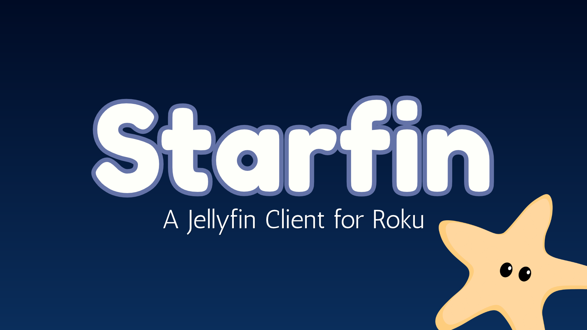
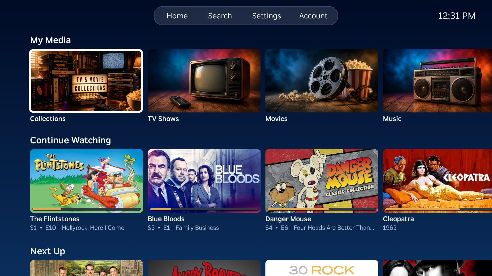
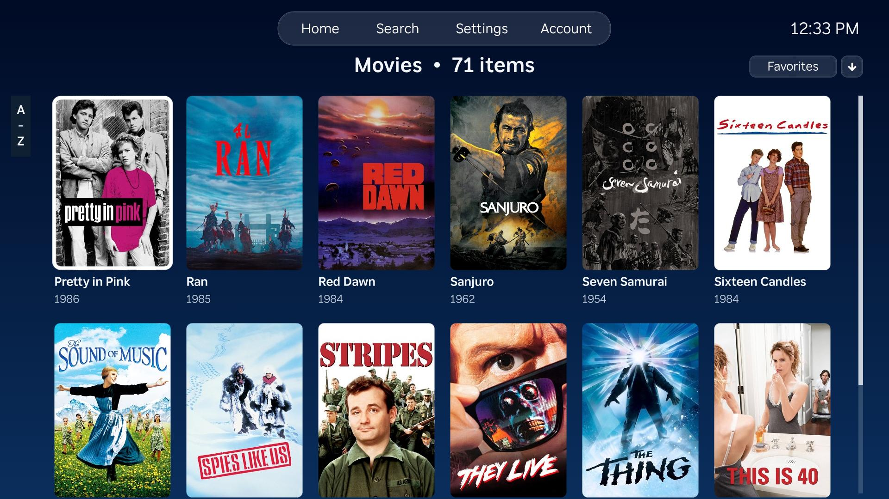
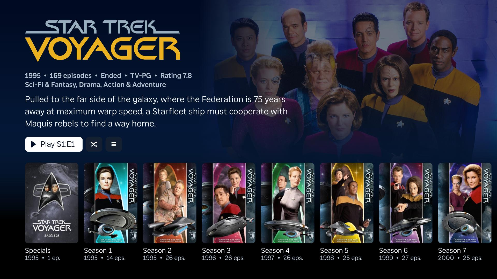
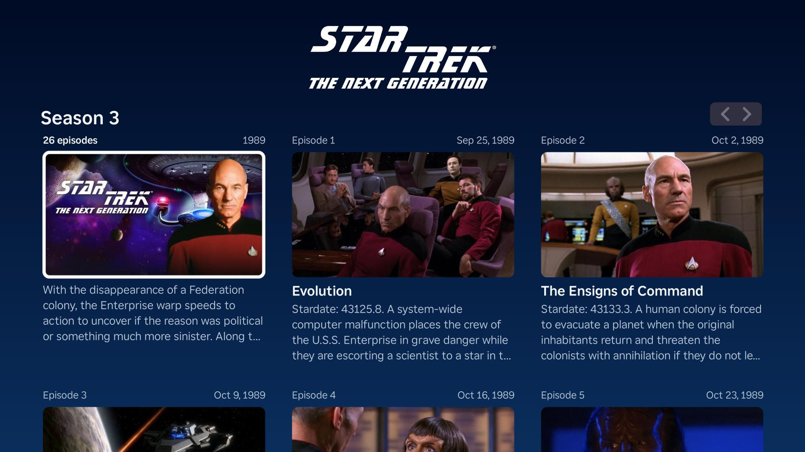
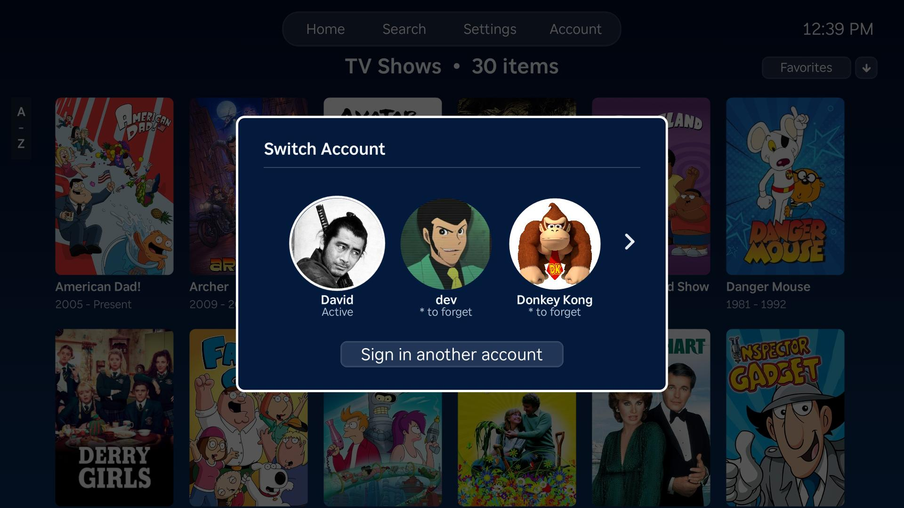
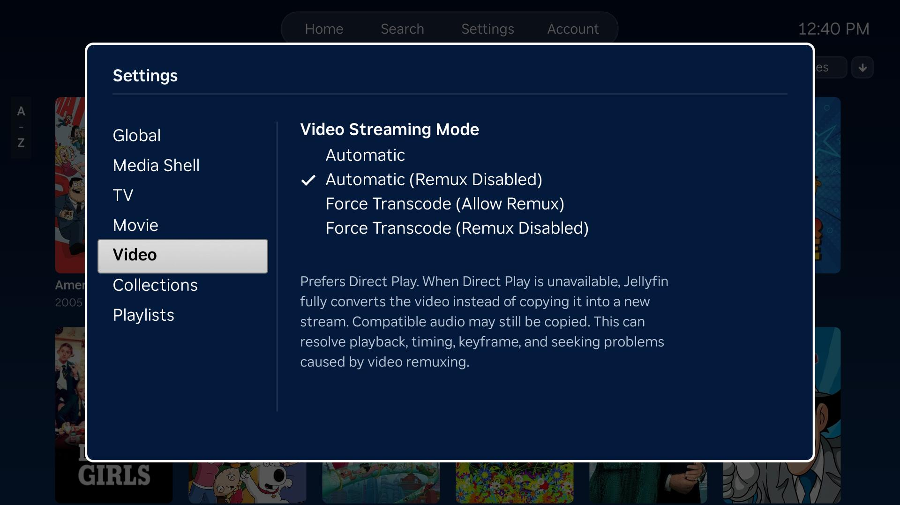

# Introduction

Starfin is a modern, full-featured Jellyfin client for Roku devices. It provides a polished interface for browsing and playing movies, TV shows, music, playlists, and Live TV from your Jellyfin server.

## Installing

In the future this app will be released on the Roku Channel Store. Until then it must be side-loaded onto your Roku device. Side-loading can sound a little intimidating at first, but it's actually pretty straightforward.

### Video Instructions

The official Roku Developer YouTube channel has a helpful video that walks through how to sideload a Roku app. You can skip the intro; this link starts at the 26-second mark.

https://youtu.be/r9HhUIWA4L0?si=OGK6Tm1SdCcLLhN-&t=26

### Written Instructions

1. On the Roku remote, press `Home` three times, `Up` two times, then `Right`, `Left`, `Right`, `Left`, `Right`.
2. Follow the on-screen prompts to enable the Developer Application Installer.
3. When the "Developer Settings" screen displays...
   - Note the `IP address`.
   - Note the username (it's always `rokudev`)
4. Read and accept the license agreement.
5. Set and note the developer web server password.
6. Restart the Roku device when prompted.

After the Roku device restarts, upload the Starfin app:

1. Find the Roku IP address under `Settings > Network > About`.
2. Download the Starfin app zip file from the [latest Starfin GitHub release](https://github.com/thedavidhoffman/starfin-roku/releases).
3. In a browser, open `http://ROKU_IP_ADDRESS`.
4. Sign in with username `rokudev` and the developer password you set.
5. Use the upload form to select the Starfin zip file from the most current release in this GitHub repository, then click `Install`.

After installation, Starfin will be available from the Roku home screen.

## Legal/Policies

- [License](LICENSE)
- [Privacy Policy](PRIVACY-POLICY.md)
- [Terms of Use](TERMS-OF-USE.md)

## AI Usage Disclaimer

This app was built with Codex, but it was not simply "vibe coded." As a senior software engineer, I keep a good eye on what Codex spits out, because there are certainly times when it spits out garbage. But when it nails it, it nails it. As a side note for all those that think that any AI projects like this are simply "AI Slop"... have you seen some of the code that people write ;) Anywhos, the code here is open-source for all to view and inspect.

# Development

See [README.DEV.md](README.DEV.md) for contributing, setup, build, deployment, debugging, and logging instructions.
